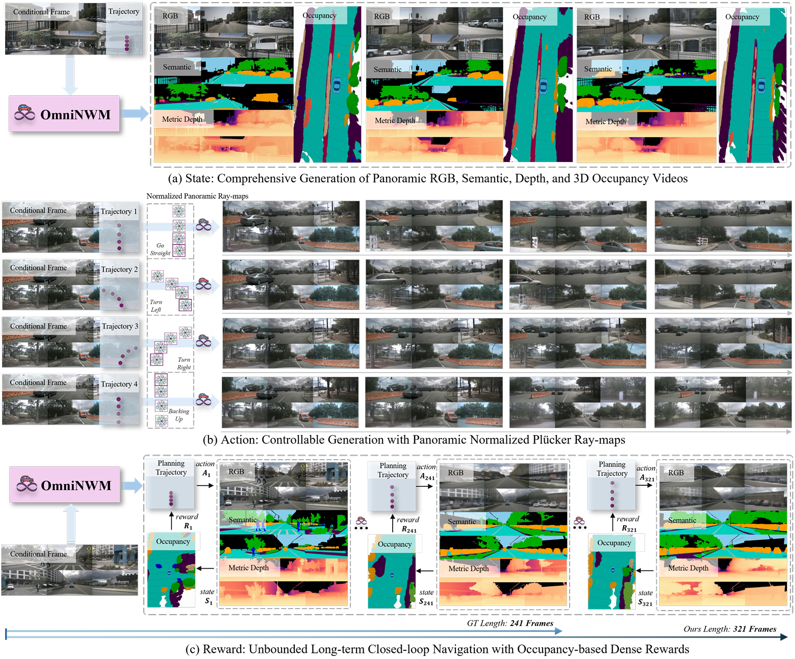
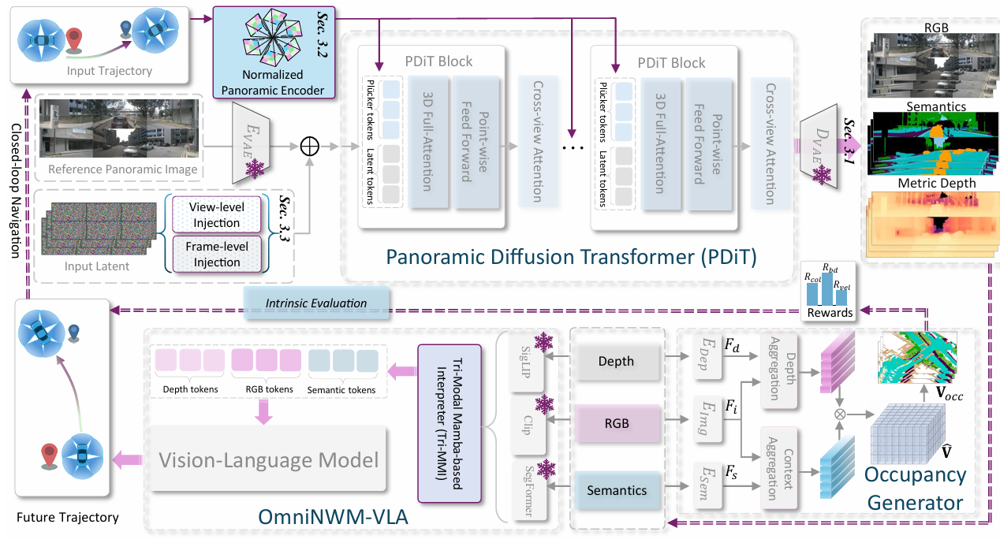

# OmniNWM: Omniscient Driving Navigation World Models

[](https://arxiv.org/abs/2510.18313)
[](https://arlo0o.github.io/OmniNWM/)
[](https://huggingface.co/papers/2510.18313)
<!-- [](LICENSE) -->


> **OmniNWM** is a unified panoramic navigation world model that advances autonomous driving simulation by jointly generating multi-modal states (RGB, semantics, depth, 3D occupancy), enabling precise action control via normalized Plücker ray-maps, and facilitating closed-loop evaluation through occupancy-based dense rewards.

---

## 🎯 Overview

OmniNWM addresses three core dimensions of autonomous driving world models:

- **📊 State**: Joint generation of panoramic RGB, semantic, metric depth, and 3D occupancy videos
- **🎮 Action**: Precise panoramic camera control via normalized Plücker ray-maps
- **🏆 Reward**: Integrated occupancy-based dense rewards for driving compliance and safety

  

---

## ✨ Key Features

| Feature | Description |
|-----------|-------------|
| **Multi-modal Generation** | Jointly generates RGB, semantic, depth, and 3D occupancy in panoramic views |
| **Precise Camera Control** | Normalized Plücker ray-maps for pixel-level trajectory interpretation |
| **Long-term Stability** | Flexible forcing strategy enables auto-regressive generation beyond GT length |
| **Closed-loop Evaluation** | Occupancy-based dense rewards enable realistic driving policy evaluation |
|**Zero-shot Generalization** | Transfers across datasets and camera configurations without fine-tuning |

---

## 🏗️ Architecture

  

---

### 💥 News
- [2025/09]: Demo is released on the [Project Page](https://arlo0o.github.io/OmniNWM/).


## 📚 Citation


```bibtex
@article{li2025omninwm,
  title={OmniNWM: Omniscient Driving Navigation World Models},
  author={Li, Bohan and Ma, Zhuang and Du, Dalong and Peng, Baorui and Liang, Zhujin and Liu, Zhenqiang and Ma, Chao and Jin, Yueming and Zhao, Hao and Zeng, Wenjun and others},
  journal={arXiv preprint arXiv:2510.18313},
  year={2025}
}
```


---


## 📄 License

This project is licensed under the Apache License 2.0 - see the [LICENSE](LICENSE) file for details.

---

## ❤️ Acknowledgments

- Built upon great open-source projects like [OpenSora](https://github.com/hpcaitech/Open-Sora) and [Qwen-VL](https://github.com/QwenLM/Qwen-VL)


---

<div align="center">

**🌟 Star us on GitHub if you find this project helpful! 🌟**

</div>

 
