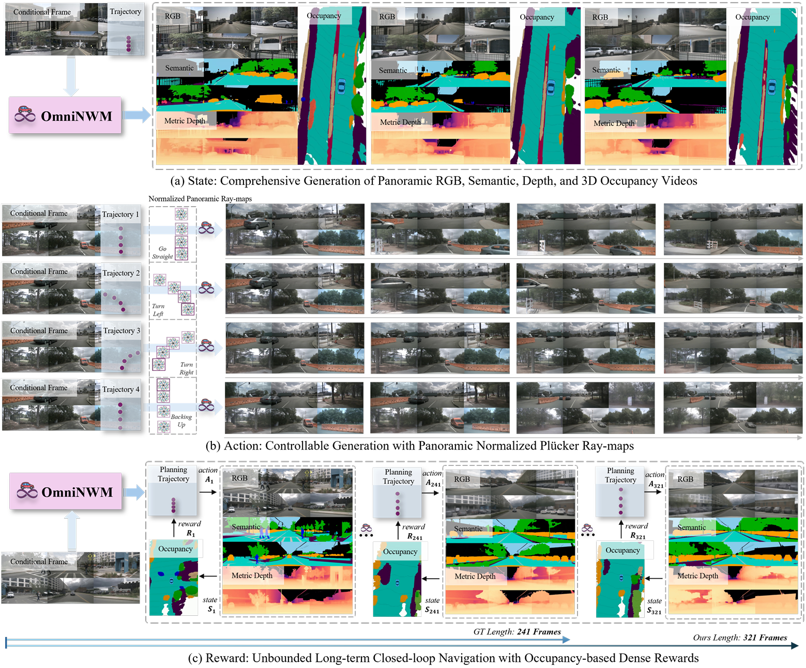
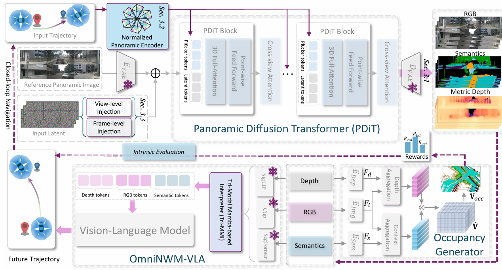

<div align="center">

# OmniNWM

**Omniscient Driving Navigation World Models**

[](https://arxiv.org/abs/2510.18313)
[](https://arlo0o.github.io/OmniNWM/)
[](https://huggingface.co/Arlolo0/OmniNWM/tree/main)
<!-- [](LICENSE) -->

[Bohan Li](https://arlo0o.github.io/libohan.github.io/), [Zhuang Ma](https://github.com/Ma-Zhuang), [Dalong Du](), [Baorui Peng](), [Zhujin Liang](), [Zhenqiang Liu](), [Chao Ma](https://scholar.google.com/citations?hl=zh-CN&user=syoPhv8AAAAJ), [Yueming Jin](https://scholar.google.com/citations?hl=zh-CN&user=s_kbB4oAAAAJ), [Hao Zhao](https://scholar.google.com/citations?hl=zh-CN&user=ygQznUQAAAAJ), [Wenjun Zeng](https://scholar.google.com/citations?user=_cUfvYQAAAAJ&hl=zh-CN), [Xin Jin](https://scholar.google.com/citations?hl=zh-CN&user=byaSC-kAAAAJ)
       


> **OmniNWM** is a unified panoramic navigation world model that advances autonomous driving simulation by jointly generating multi-modal states (RGB, semantics, depth, 3D occupancy), enabling precise action control via normalized Plücker ray-maps, and facilitating closed-loop evaluation through occupancy-based dense rewards.

---



</div>

<br>

## ✨ Key Features

| Feature | Description |
|-----------|-------------|
| **Multi-modal Generation** | Jointly generates RGB, semantic, depth, and 3D occupancy in panoramic views |
| **Precise Camera Control** | Normalized Plücker ray-maps for pixel-level trajectory interpretation |
| **Long-term Stability** | Flexible forcing strategy enables auto-regressive generation beyond GT length |
| **Closed-loop Evaluation** | Occupancy-based dense rewards enable realistic driving policy evaluation |
|**Zero-shot Generalization** | Transfers across datasets and camera configurations without fine-tuning |

---

## 🏗️ Architecture




---

## 🛠️ Quickstart

### 1. Installation


> **Manual Patch Required**: After installation, you must manually patch `transformers` for compatibility. See step 4 below.

1.  **Clone the repository**
    ```bash
    git clone https://github.com/Ma-Zhuang/OmniNWM.git
    cd OmniNWM
    ```

2.  **Create directories**
    ```bash
    mkdir -p pretrained data
    ```

3.  **Install dependencies** (Recommended: `torch >= 2.4.0`)
    ```bash
    pip install -v -e .
    pip install "huggingface_hub[cli]"
    ```

4.  **Apply Patch** 
    Locate `transformers/modeling_utils.py` (usually in your conda env `site-packages`) and modify the version check:
    ```python
    # Find this line:
    if self._tp_plan is not None and is_torch_greater_or_equal("2.3"):
    
    # Change to:
    if self._tp_plan is not None and is_torch_greater_or_equal("2.5"):
    ```

### 2. Model Download

Download the official checkpoints and auxiliary models.

**OmniNWM Weights:**
```bash
pip install "huggingface_hub[cli]"
huggingface-cli download Arlolo0/OmniNWM --local-dir ./pretrained
```

**Open-Sora-v2 Weights:**
```bash
huggingface-cli download hpcai-tech/Open-Sora-v2 --local-dir ./pretrained
```

### 3. Data Preparation

1.  **nuScenes Dataset**: Download **Trainval** splits (Full dataset v1.0) from the [official website](https://www.nuscenes.org/download) and place in `./data/nuscenes`.
2.  **Depth Annotations**: Download from [HuggingFace](https://huggingface.co/datasets/Arlolo0/12HZ-Depth/tree/main).
3.  **Segmentation Annotations**: Download from [HuggingFace](https://huggingface.co/datasets/Arlolo0/12HZ-Segmentation/tree/main).

**Expected Directory Structure:**
```none
OmniNWM
├── assets
├── build
├── configs
├── data
│   ├── nuscenes
│   │   ├── samples
│   │   │   ├── CAM_BACK
│   │   │   ├── CAM_BACK_LEFT
│   │   │   ├── ...
│   │   │   ├── CAM_FRONT_RIGHT
│   │   ├── sweeps
│   │   │   ├── CAM_BACK
│   │   │   ├── CAM_BACK_LEFT
│   │   │   ├── ...
│   │   │   ├── CAM_FRONT_RIGHT
│   ├── nuscenes_12hz_depth_unzip
│   │   ├── adf04...
│   │   ├── adf06...
│   │   ├── ...
│   │   ├── ecd00...
│   ├── nuscenes_seg
│   │   ├── samples_seg
│   │   │   ├── CAM_BACK
│   │   │   ├── CAM_BACK_LEFT
│   │   │   ├── ...
│   │   │   ├── CAM_FRONT_RIGHT
│   │   ├── sweeps_seg
│   │   │   ├── CAM_BACK
│   │   │   ├── CAM_BACK_LEFT
│   │   │   ├── ...
│   │   │   ├── CAM_FRONT_RIGHT
│   ├── nuscenes_interp_12Hz_infos_train_with_bid_caption.pkl
│   ├── nuscenes_interp_12Hz_infos_val_with_bid_caption.pkl
├── omninwm
├── pretrained
│   ├── hunyuan_vae.safetensors
│   ├── occ.pth
│   ├── Open_Sora_v2.safetensors
├── tools
```

### 4.  OmniNWM-VLA
Check [OmniNWM-VLA](omninwm/models/OmniNWM-VLA) for more implementation details, including :

-  Integrated Tri-MMI for tri-modal fusion 
-  ShareGPT format dataset generation pipeline 
-  codebase setup with nuScenes support

## 🚀 Usage

### Inference (Trajectory-to-Video)

Generate videos from trajectories. Ensure you update the checkpoint path in `configs/inference/infer.py` before running.

| Task | Command | Description |
| :--- | :--- | :--- |
| **Standard Inference** | `torchrun --nproc-per-node 8 tools/inference.py configs/inference/infer.py` | Multi-GPU, nuScenes 448x800, 6 cams, 33 frames |
| **OOD Nuplan Inference** | `torchrun --nproc-per-node 8 tools/inference.py configs/inference/infer_nuplan.py` | nuPlan dataset, manual trajectory input |
| **VLA Closed-Loop Test** | `torchrun --nproc-per-node 8 tools/inference.py configs/inference/infer_with_occ_vla.py` | Closed-loop test with occupancy prediction (321 frames) |

### Training

Training is divided into stages for stability.

```bash
# Stage 1: Small resolution, short video, single model output
bash dist_train_mlp.sh configs/train/stage_1.py

# Stage 2: Small resolution, short video, multi-model output
bash dist_train_mlp.sh configs/train/stage_2.py

# Stage 3: High resolution, long/short video, multi-model output
bash dist_train_mlp.sh configs/train/stage_3.py
```

---

## 📚 Citation

If you find OmniNWM useful for your research, please consider citing:

```bibtex
@article{li2025omninwm,
  title={OmniNWM: Omniscient Driving Navigation World Models},
  author={Li, Bohan and Ma, Zhuang and Du, Dalong and Peng, Baorui and Liang, Zhujin and Liu, Zhenqiang and Ma, Chao and Jin, Yueming and Zhao, Hao and Zeng, Wenjun and others},
  journal={arXiv preprint arXiv:2510.18313},
  year={2025}
}
```

---

## 📄 License

This project is licensed under the Apache License 2.0. See the [LICENSE](LICENSE) file for details.

## ❤️ Acknowledgments

Built upon excellent open-source projects including [OpenSora](https://github.com/hpcaitech/Open-Sora) and [Qwen-VL](https://github.com/QwenLM/Qwen-VL).

<div align="center">

**🌟 Star us on GitHub if you like this project! 🌟**

</div>