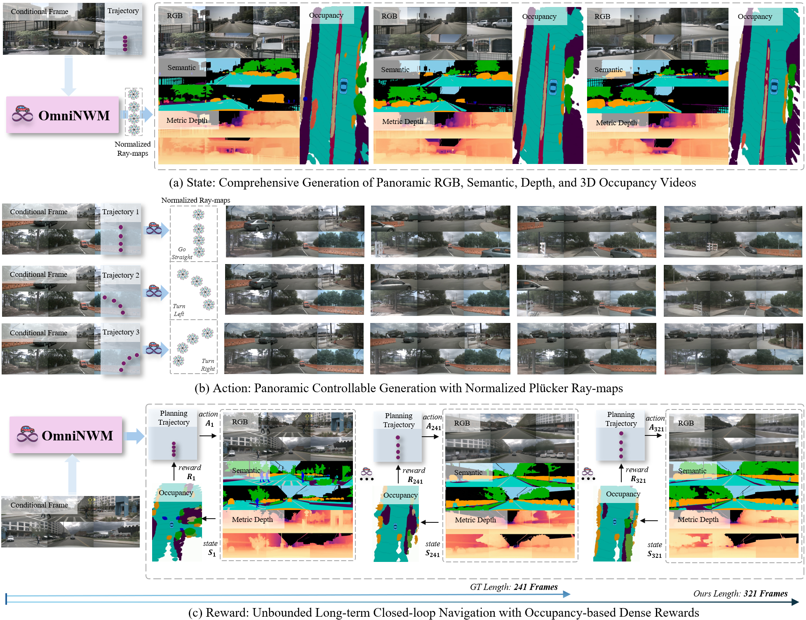
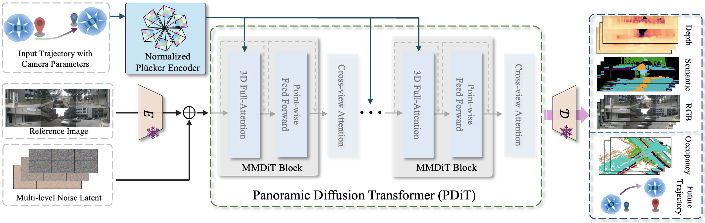

# OmniNWM: Omniscient Navigation World Models for Autonomous Driving

[](https://github.com/Arlo0o/OmniNWM)
[]([https://omninwm.github.io](https://github.com/Arlo0o/OmniNWM))
[](LICENSE)

> **OmniNWM** is a unified panoramic navigation world model that advances autonomous driving simulation by jointly generating multi-modal states (RGB, semantics, depth, 3D occupancy), enabling precise action control via normalized Plücker ray-maps, and facilitating closed-loop evaluation through occupancy-based dense rewards.

---

## 🎯 Overview

OmniNWM addresses three core dimensions of autonomous driving world models:

- **📊 State**: Joint generation of panoramic RGB, semantic, metric depth, and 3D occupancy videos
- **🎮 Action**: Precise panoramic camera control via normalized Plücker ray-maps
- **🏆 Reward**: Integrated occupancy-based dense rewards for driving compliance and safety

  
*OmniNWM enables comprehensive multi-modal generation and precise control for autonomous driving simulation.*

---

## ✨ Key Features

| Feature | Description |
|---------|-------------|
| **Multi-modal Generation** | Jointly generates RGB, semantic, depth, and 3D occupancy in panoramic views |
| **Precise Camera Control** | Uses normalized Plücker ray-maps for pixel-level trajectory interpretation |
| **Long-term Stability** | Flexible forcing strategy enables auto-regressive generation beyond training sequences |
| **Closed-loop Evaluation** | Occupancy-based dense rewards enable realistic driving policy evaluation |
| **Zero-shot Generalization** | Transfers across datasets and camera configurations without fine-tuning |

---

## 🏗️ Architecture

  
*Overall framework of OmniNWM supporting multi-modal generation, precise control, and closed-loop evaluation.*

### Core Components:
- **Panoramic Diffusion Transformer (PDiT)**: Generates aligned RGB, semantic, and depth videos
- **3D Occupancy Module**: Converts 2D outputs into 3D semantic occupancy volumes
- **Plücker Ray-map Encoder**: Provides scale- and pose-invariant camera control
- **OmniNWM-VLA Planner**: Semantic-geometric reasoning agent for trajectory planning

---

## 📊 Results Highlights

### Video Generation Quality
| Method | FID ↓ | FVD ↓ |
|--------|-------|-------|
| Vista | 6.90 | 89.40 |
| DrivingWorld | 7.40 | 90.90 |
| **OmniNWM** | **5.45** | **23.63** |

### Occupancy Prediction
| Method | Input | mIoU ↑ |
|--------|-------|--------|
| OccGen | C | 14.5 |
| LMSCNet | L | 11.5 |
| **OmniNWM** | C | **19.8** |

### Camera Control Accuracy
| Method | Rotation Error (×10⁻²) ↓ | Translation Error (×10⁻²) ↓ |
|--------|--------------------------|----------------------------|
| UniScene | 1.98 | 12.74 |
| **OmniNWM** | **1.42** | **5.14** |

---

## 🎥 Demo Videos

### Precise Panoramic Control
  
*Consistent multi-view generation from diverse input trajectories.*

### Long-term Navigation
  
*Stable 321-frame generation enabled by flexible forcing strategy.*

### Multi-modal Outputs
  
*Joint generation of RGB, semantic, depth, and 3D occupancy.*

---


## 📈 Performance

### Quantitative Results


### Qualitative Comparisons
  
*OmniNWM generates more structurally consistent and detailed scenes compared to previous methods.*

---

## 📚 Citation

If you find our work useful, please cite:

```bibtex
@article{li2025omninwm,
  title={OmniNWM: Omniscient Navigation World Models for Autonomous Driving},
  author={Li, Bohan and Ma, Zhuang and Liang, Zhujin and Peng, Baorui and Liu, Zhenqiang and Du, Dalong and Ma, Chao and Jin, Yueming and Zhao, Hao and Zeng, Wenjun and Jin, Xin},
  journal={arXiv preprint arXiv:XXXX.XXXXX},
  year={2025}
}
```


---

## 📄 License

This project is licensed under the Apache License 2.0 - see the [LICENSE](LICENSE) file for details.

---

## 🙏 Acknowledgments

- Built upon great open-source projects like [OpenSora](https://github.com/hpcaitech/Open-Sora) and [Qwen-VL](https://github.com/QwenLM/Qwen-VL)


---

<div align="center">

**🌟 Star us on GitHub if you find this project helpful! 🌟**

</div>

---

*Note: This repository is under active development. Code and models will be released soon.*
