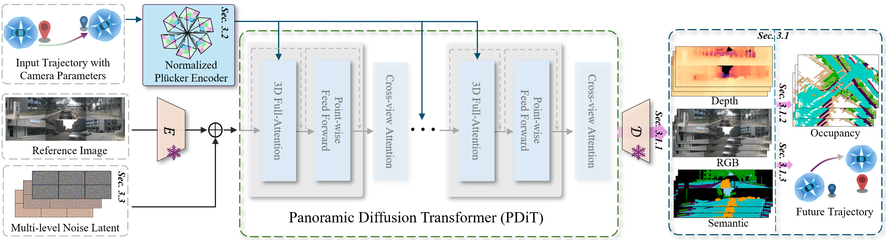

# OmniNWM: Omni Driving Navigation World Models

[](https://github.com/Arlo0o/OmniNWM)
[](https://arlo0o.github.io/OmniNWM/)
[](LICENSE)

> **OmniNWM** is a unified panoramic navigation world model that advances autonomous driving simulation by jointly generating multi-modal states (RGB, semantics, depth, 3D occupancy), enabling precise action control via normalized Plücker ray-maps, and facilitating closed-loop evaluation through occupancy-based dense rewards.

---

## 🎯 Overview

OmniNWM addresses three core dimensions of autonomous driving world models:

- **📊 State**: Joint generation of panoramic RGB, semantic, metric depth, and 3D occupancy videos
- **🎮 Action**: Precise panoramic camera control via normalized Plücker ray-maps
- **🏆 Reward**: Integrated occupancy-based dense rewards for driving compliance and safety

  

---

## ✨ Key Features

| Feature | Description |
|-----------|-------------|
| **Multi-modal Generation** | Jointly generates RGB, semantic, depth, and 3D occupancy in panoramic views |
| **Precise Camera Control** | Normalized Plücker ray-maps for pixel-level trajectory interpretation |
| **Long-term Stability** | Flexible forcing strategy enables auto-regressive generation beyond GT length |
| **Closed-loop Evaluation** | Occupancy-based dense rewards enable realistic driving policy evaluation |
|**Zero-shot Generalization** | Transfers across datasets and camera configurations without fine-tuning |

---

## 🏗️ Architecture

  

---

### 💥 News
- [2025/09]: Demo is released on the [Project Page](https://arlo0o.github.io/OmniNWM/).


## 📚 Citation


```bibtex
@misc{li2025omninwmomniscientdrivingnavigation,
      title={OmniNWM: Omniscient Driving Navigation World Models}, 
      author={Bohan Li and Zhuang Ma and Dalong Du and Baorui Peng and Zhujin Liang and Zhenqiang Liu and Chao Ma and Yueming Jin and Hao Zhao and Wenjun Zeng and Xin Jin},
      year={2025},
      eprint={2510.18313},
      archivePrefix={arXiv},
      primaryClass={cs.CV},
      url={https://arxiv.org/abs/2510.18313}, 
}
```


---


## 📄 License

This project is licensed under the Apache License 2.0 - see the [LICENSE](LICENSE) file for details.

---

## ❤️ Acknowledgments

- Built upon great open-source projects like [OpenSora](https://github.com/hpcaitech/Open-Sora) and [Qwen-VL](https://github.com/QwenLM/Qwen-VL)


---

<div align="center">

**🌟 Star us on GitHub if you find this project helpful! 🌟**

</div>

---

*Note: This repository is under active development. Paper and Code will be released soon.*
