<div align="center">

# OmniNWM-VLA


</div>

## 📢 News

<!-- - **[2026.2]** 🎉 OmniNWM v1.0 released with full training pipeline -->
- **[2026.2]** 🚀 Integrated SSR-MIDI for tri-modal fusion with Mamba-SSM 2.2.4
- **[2026.2]** 📊 ShareGPT format dataset generation pipeline completed
- **[2026.1]** 🔧 Initial codebase setup with nuScenes support

## 🌟 Highlights

**OmniNWM-VLA** is a state-of-the-art driving VLA model for autonomous driving trajectory prediction, featuring:

- 🎯 **Tri-Modal Fusion**: Seamlessly integrates RGB, depth, and semantic information
- 🚗 **360° Perception**: Full panoramic understanding with 6-camera system
- ⚡ **12Hz High-Frequency**: 36 trajectory waypoints over 3 seconds prediction
- 🧠 **Advanced Architecture**: Qwen2.5-VL-7B + SSR-MIDI fusion with TMI feature injection
- 📊 **Complete Pipeline**: End-to-end solution from raw sensor data to trajectory prediction


## 🏗️ System Architecture

```mermaid
graph TB
    A[nuScenes Dataset] --> B[Multi-Modal Data Generation]
    B --> C[RGB Images<br/>6 Cameras]
    B --> D[Depth Maps<br/>ZoeDepth/MiDaS]
    B --> E[Semantic Maps<br/>SegFormer-B5]
    
    C --> F[CLIP-ViT-L<br/>1024-dim]
    D --> G[SigLIP<br/>1152-dim]
    E --> H[SegFormer<br/>512-dim]
    
    F --> I[SSR-MIDI Fusion<br/>Mamba Architecture]
    G --> I
    H --> I
    
    I --> J[TMI Features<br/>10×3584-dim]
    J --> K[Qwen2.5-VL-7B<br/>LoRA Fine-tuning]
    K --> L[Trajectory Prediction<br/>36 waypoints @ 12Hz]
    
    style A fill:#e1f5fe
    style I fill:#fff3e0
    style K fill:#f3e5f5
    style L fill:#e8f5e9
```



## 📁 Project Structure

```
OmniNWM-VLA/
│
├── 📊 nuscenes_multimodal_dataset/     # Data Generation Pipeline
│   ├── src/                            # Core modules
│   │   ├── core/                       # Data processing core
│   │   │   ├── nuscenes_reader.py      # nuScenes data loader with CAN bus
│   │   │   ├── trajectory_calculator.py # 12Hz trajectory interpolation
│   │   │   └── coordinate_transform.py  # Coordinate system transformations
│   │   ├── processors/                 # Multi-modal processors
│   │   │   ├── depth_processor.py      # Depth estimation (ZoeDepth/MiDaS)
│   │   │   ├── semantic_processor.py   # Semantic segmentation (SegFormer)
│   │   │   └── multimodal_processor.py # Multi-modal integration
│   │   ├── generators/                 # Data generators
│   │   │   ├── conversation_prompt_generator.py # Dialog generation
│   │   │   └── sharegpt_formatter.py   # ShareGPT formatting
│   │   └── utils/                      # Utility functions
│   ├── scripts/                        # Execution scripts
│   │   └── build_sharegpt_dataset.py   # Main dataset builder
│   ├── configs/                        # Configuration files
│   │   └── sharegpt_dataset_config.yaml
│   └── run_sharegpt_generation.sh      # One-click generation script
│
├── 🤖 tri_modal_qwen/                  # Model Training Pipeline
│   ├── SSR/                            # SSR-MIDI Implementation
│   │   ├── ssr/                        # Core SSR modules
│   │   │   ├── models/                 
│   │   │   │   └── midi.py            # MIDI tri-modal fusion model
│   │   │   ├── train/
│   │   │   │   └── train_reasoning.py  # Stage 1 training script
│   │   │   └── data/
│   │   │       └── ssr_cot.py         # SSR-CoT dataset loader
│   │   └── run_stage1.sh              # Stage 1 training launcher
│   ├── src/tri_modal_qwen/            # Core model implementation
│   │   ├── modeling/                   # Model architecture
│   │   │   ├── modeling_tri_modal_qwen.py # Main model class
│   │   │   ├── configuration_tri_modal_qwen.py # Model configuration
│   │   │   └── modules/                # Core components
│   │   │       ├── tmi_module.py       # TMI feature module
│   │   │       ├── encoders.py         # Visual encoders
│   │   │       └── fusion.py           # Fusion layers
│   │   └── data/                       # Data handling
│   │       ├── dataset.py              # Dataset classes
│   │       ├── processor.py            # Data processors
│   │       └── path_mapper.py          # Path mapping utilities
│   ├── llama_factory_configs/         # LLaMA Factory configs
│   │   ├── stage2_end_to_end.yaml     # Training configuration
│   │   ├── custom_trainer.py          # Custom trainer with TMI
│   │   └── inject_tmi_to_qwen.py      # TMI injection logic
│   ├── scripts/                       # Utility scripts
│   │   ├── extract_tmi_features.py    # Feature extraction
│   │   ├── clean_image_tokens.py      # Data cleaning
│   │   └── inference.py               # Inference script
│   ├── run_midi_feature_extraction.sh # Feature extraction launcher
│   ├── run_stage2_llama_factory.sh   # Stage 2 training launcher
│   ├── run_evaluation.sh              # Evaluation launcher
│   └── evaluate_stage2.py             # Evaluation metrics
│
├── 📈 assets/                          # Documentation assets
├── 📝 requirements.txt                 # Python dependencies
├── 🔧 setup.py                        # Installation script
└── 📖 README.md                       # This file
```

## 🚀 Quick Start

### Prerequisites

- Python >= 3.9
- PyTorch 2.5.1 with CUDA 12.4
- CUDA >= 12.4
- 100GB+ disk space
- 32GB+ RAM (recommended)
- 8+ NVIDIA A100/V100 GPUs (for training)


### Pretrained CKPT

SSR_TMI: https://huggingface.co/bryan111232/SSR_TMI

OmniNWM-VLA: https://huggingface.co/bryan111232/OmniNWM-VLA

### Installation

1. **Clone the repository**
```bash
git clone https://github.com/your-username/OmniNWM-VLA.git
cd OmniNWM-VLA
```

2. **Create conda environment**
```bash
conda create -n omnivla python=3.9
conda activate omnivla
```

3. **Install PyTorch with CUDA 12.4**
```bash
pip install torch==2.5.1 torchvision==0.20.1 torchaudio==2.5.1 --index-url https://download.pytorch.org/whl/cu124
```

4. **Install key dependencies**
```bash
# Core libraries
pip install transformers==4.49.0
pip install accelerate==1.4.0
pip install peft==0.14.0
pip install datasets==3.4.1

# Vision libraries
pip install qwen-vl-utils==0.0.10
pip install pillow==10.2.0
pip install timm==1.0.15

# SSM and optimization
pip install mamba-ssm==2.2.4
pip install flash-attn==2.7.4.post1 --no-build-isolation
pip install causal-conv1d==1.5.0.post8
pip install einops==0.8.1

# Other utilities
pip install pyyaml==6.0.3
pip install tqdm==4.67.1
pip install numpy==1.26.4
pip install pandas==2.2.3
```

5. **Install remaining dependencies**
```bash
pip install -r requirements.txt
pip install -e .
```

6. **Download pretrained models**
```bash
# Create model directories
mkdir -p models/{clip,siglip,segmentation_models,Qwen2.5,state-spaces}

# Download models (provide download script or instructions)
bash scripts/download_models.sh
```

## 📊 Dataset Preparation

### Step 1: Download nuScenes Dataset

Download the nuScenes dataset from [official website](https://www.nuscenes.org/download):
```bash
# Directory structure after download
/path/to/nuscenes/
├── maps/
├── samples/
├── sweeps/
└── v1.0-trainval/
```

### Step 2: Generate Multi-Modal ShareGPT Dataset

```bash
# Configure paths in config file
vim nuscenes_multimodal_dataset/configs/sharegpt_dataset_config.yaml

# Run dataset generation
cd nuscenes_multimodal_dataset
bash run_sharegpt_generation.sh

# Or run with custom parameters
python scripts/build_sharegpt_dataset.py \
    --config configs/sharegpt_dataset_config.yaml \
    --max-samples 1000  # For testing
```

### Generated Dataset Example

<details>
<summary>📄 Click to see ShareGPT format example</summary>

```json
{
  "id": "scene_0001_sample_0042",
  "images": [
    "/data/nuscenes/samples/CAM_FRONT/n008-2018-08-01-15-16-36-0400__CAM_FRONT__1533151603512404.jpg",
    "/data/nuscenes/samples/CAM_FRONT_LEFT/n008-2018-08-01-15-16-36-0400__CAM_FRONT_LEFT__1533151603504799.jpg",
    "/data/nuscenes/samples/CAM_FRONT_RIGHT/n008-2018-08-01-15-16-36-0400__CAM_FRONT_RIGHT__1533151603520482.jpg",
    "/data/nuscenes/samples/CAM_BACK/n008-2018-08-01-15-16-36-0400__CAM_BACK__1533151603537558.jpg",
    "/data/nuscenes/samples/CAM_BACK_LEFT/n008-2018-08-01-15-16-36-0400__CAM_BACK_LEFT__1533151603547405.jpg",
    "/data/nuscenes/samples/CAM_BACK_RIGHT/n008-2018-08-01-15-16-36-0400__CAM_BACK_RIGHT__1533151603528113.jpg"
  ],
  "depth_maps": [
    "/data/output/depth/samples/CAM_FRONT/1533151603512404_depth.png",
    "/data/output/depth/samples/CAM_FRONT_LEFT/1533151603504799_depth.png",
    "/data/output/depth/samples/CAM_FRONT_RIGHT/1533151603520482_depth.png",
    "/data/output/depth/samples/CAM_BACK/1533151603537558_depth.png",
    "/data/output/depth/samples/CAM_BACK_LEFT/1533151603547405_depth.png",
    "/data/output/depth/samples/CAM_BACK_RIGHT/1533151603528113_depth.png"
  ],
  "semantic_maps": [
    "/data/output/semantic/samples/CAM_FRONT/1533151603512404_semantic.png",
    "/data/output/semantic/samples/CAM_FRONT_LEFT/1533151603504799_semantic.png",
    "/data/output/semantic/samples/CAM_FRONT_RIGHT/1533151603520482_semantic.png",
    "/data/output/semantic/samples/CAM_BACK/1533151603537558_semantic.png",
    "/data/output/semantic/samples/CAM_BACK_LEFT/1533151603547405_semantic.png",
    "/data/output/semantic/samples/CAM_BACK_RIGHT/1533151603528113_semantic.png"
  ],
  "messages": [
    {
      "role": "user",
      "content": "You are an autonomous driving agent. You have access to multi-modal sensory data from a vehicle's 6-camera system providing 360° coverage: front, front-left, front-right, rear, rear-left, and rear-right views. Additionally, you have corresponding depth maps and semantic segmentation maps for each camera view. Your task is to predict the vehicle's detailed future trajectory over the next 3 seconds at 12Hz sampling rate (36 waypoints total).\n\nProvided is the ego vehicle status recorded over the last 1.0 seconds (at 0.083-second intervals, 12Hz). This includes the x, y coordinates and heading angle of the ego vehicle in the ego-coordinate system. Positive x means forward direction, positive y means leftward direction, and heading angle is in radians. The data is presented in the format [x, y, heading]:\n\n[0.000, 0.000, 0.000] (t-1.000s)\n[0.083, 0.002, 0.001] (t-0.917s)\n[0.167, 0.004, 0.002] (t-0.833s)\n[0.250, 0.006, 0.003] (t-0.750s)\n[0.334, 0.008, 0.004] (t-0.667s)\n[0.418, 0.010, 0.005] (t-0.583s)\n[0.502, 0.012, 0.006] (t-0.500s)\n[0.587, 0.014, 0.007] (t-0.417s)\n[0.672, 0.016, 0.008] (t-0.333s)\n[0.757, 0.018, 0.009] (t-0.250s)\n[0.842, 0.020, 0.010] (t-0.167s)\n[0.928, 0.022, 0.011] (t-0.083s)\n\nAnalyze the multi-modal sensor data (RGB images, depth maps, and semantic segmentation) from all 6 camera views to understand the surrounding environment, road structure, traffic conditions, and potential obstacles. Based on this comprehensive analysis and the vehicle's current motion pattern, predict the future trajectory."
    },
    {
      "role": "assistant",
      "content": "<PLANNING>Predicted future trajectory for the next 3 seconds (36 waypoints sampled at 12Hz, 0.083-second intervals), including position and orientation in ego-vehicle coordinate system. Positive x means forward direction, positive y means leftward direction, heading angle in radians. The output is formatted as [x, y, heading]:\n\n[1.014, 0.024, 0.012] (t+0.083s)\n[1.101, 0.026, 0.013] (t+0.167s)\n[1.188, 0.028, 0.014] (t+0.250s)\n[1.275, 0.030, 0.015] (t+0.333s)\n[1.363, 0.032, 0.016] (t+0.417s)\n[1.451, 0.034, 0.017] (t+0.500s)\n[1.539, 0.036, 0.018] (t+0.583s)\n[1.628, 0.038, 0.019] (t+0.667s)\n[1.717, 0.040, 0.020] (t+0.750s)\n[1.806, 0.042, 0.021] (t+0.833s)\n[1.895, 0.044, 0.022] (t+0.917s)\n[1.985, 0.046, 0.023] (t+1.000s)\n[2.075, 0.048, 0.024] (t+1.083s)\n[2.165, 0.050, 0.025] (t+1.167s)\n[2.255, 0.052, 0.026] (t+1.250s)\n[2.346, 0.054, 0.027] (t+1.333s)\n[2.437, 0.056, 0.028] (t+1.417s)\n[2.528, 0.058, 0.029] (t+1.500s)\n[2.619, 0.060, 0.030] (t+1.583s)\n[2.711, 0.062, 0.031] (t+1.667s)\n[2.803, 0.064, 0.032] (t+1.750s)\n[2.895, 0.066, 0.033] (t+1.833s)\n[2.987, 0.068, 0.034] (t+1.917s)\n[3.080, 0.070, 0.035] (t+2.000s)\n[3.173, 0.072, 0.036] (t+2.083s)\n[3.266, 0.074, 0.037] (t+2.167s)\n[3.359, 0.076, 0.038] (t+2.250s)\n[3.453, 0.078, 0.039] (t+2.333s)\n[3.547, 0.080, 0.040] (t+2.417s)\n[3.641, 0.082, 0.041] (t+2.500s)\n[3.735, 0.084, 0.042] (t+2.583s)\n[3.830, 0.086, 0.043] (t+2.667s)\n[3.925, 0.088, 0.044] (t+2.750s)\n[4.020, 0.090, 0.045] (t+2.833s)\n[4.115, 0.092, 0.046] (t+2.917s)\n[4.211, 0.094, 0.047] (t+3.000s)</PLANNING>"
    }
  ],
  "metadata": {
    "scene_token": "cc8c0bf57f984915a77078b10eb33198",
    "sample_token": "39586f9d59004284a7114a68825e8eec",
    "timestamp": 1533151603512404,
    "trajectory_points": 36,
    "historical_points": 12,
    "can_bus_enabled": true
  }
}
```

</details>

## 🎓 Training Pipeline

Our training follows a multi-stage pipeline:

### Stage 1: SSR-MIDI Training

Train the SSR-MIDI fusion model for tri-modal feature learning:

```bash
cd tri_modal_qwen/SSR

# Configure training parameters
export CUDA_VISIBLE_DEVICES=0,1,2,3,4,5,6,7
export USE_PRECOMPUTED_FEATURES=false  # Use real-time extraction

# Run SSR-MIDI training
bash run_stage1.sh
```

**Configuration highlights**:
- Architecture: MIDI with Mamba-SSM backbone
- Input: RGB (CLIP-ViT-L), Depth (SigLIP), Semantic (SegFormer-B5)
- Training: FSDP distributed training across 8 GPUs
- Learning rate: 1e-4 with cosine scheduler
- Batch size: 1 per GPU with gradient accumulation
- Output: Trained fusion model for TMI feature extraction

### Stage 2: TMI Feature Extraction

Extract tri-modal features using the trained SSR-MIDI model:

```bash
cd tri_modal_qwen

# Set MIDI mode (recommended)
export USE_MIDI_MODE=true

# Run feature extraction
bash run_midi_feature_extraction.sh
```

**Output**: TMI features saved as `.npy` files (10 TOR tokens × 3584 dimensions)

### Stage 3: LLaMA Factory Fine-tuning

Train the Qwen2.5-VL model using extracted features:

```bash
# Ensure TMI features are extracted
bash run_stage2_llama_factory.sh
```

**Configuration highlights**:
- Base model: Qwen2.5-VL-7B-Instruct
- LoRA: rank=16, alpha=32
- Learning rate: 2e-5
- Batch size: 2 per GPU × 8 GPUs
- Training epochs: 8

### Stage 4: Model Evaluation

Evaluate the trained model:

```bash
bash run_evaluation.sh
```

**Metrics computed**:
- **ADE**: Average Displacement Error
- **FDE**: Final Displacement Error
- **Miss Rate**: Percentage of predictions with FDE > 2.0m
- **L2 Errors**: Displacement errors at 1s, 2s, 3s

## 🔬 Key Technologies

### 1. Tri-Modal Fusion Architecture

 

- **RGB Encoder**: CLIP-ViT-Large (1024-dim features)
- **Depth Encoder**: SigLIP (1152-dim features)
- **Semantic Encoder**: SegFormer-B5 (512-dim features)
- **Fusion**: SSR-MIDI with Mamba architecture (mamba-ssm 2.2.4)

### 2. TOR (Thinking-of-Route) Tokens

Spatial-anchored special tokens for encoding different spatial semantics:
- 10 TOR tokens strategically placed in prompts
- Each encodes 3584-dimensional features
- Aligned with Qwen2.5-VL hidden dimensions

### 3. 12Hz High-Frequency Trajectory

- Interpolation from nuScenes native 2Hz to 12Hz
- 36 waypoints over 3 seconds
- Smooth trajectory with physical constraints

### 4. TMI Feature Injection

Dynamic injection mechanism bypassing LLaMA Factory limitations:
```python
# Simplified injection logic
def inject_tmi_support(model, tmi_features):
    # Add projection layer
    model.tmi_projection = nn.Linear(4096, 3584)
    # Modify forward pass
    projected_features = model.tmi_projection(tmi_features)
    # Inject into hidden states
    return model
```

### 5. Optimization Technologies

- **Flash Attention 2**: Efficient attention computation (flash-attn 2.7.4)
- **Causal Conv1D**: Optimized causal convolutions (causal-conv1d 1.5.0)
- **PEFT/LoRA**: Parameter-efficient fine-tuning (peft 0.14.0)
- **Accelerate**: Distributed training support (accelerate 1.4.0)

## 📈 Performance

### Trajectory Prediction Results

| Model | ADE (m) ↓ | FDE (m) ↓ | Collision Rate (%) ↓ | L2@1s (12Hz) | L2@2s (12Hz) | L2@3s (12Hz) |
|-------|-----------|-----------|---------------------|--------------|--------------|--------------|
| Baseline | 1.82 | 3.45 | 35.6 | 0.95 | 1.88 | 3.45 |
| OmniNWM-VLA (Ours) | **0.8879** | **1.4761** | **21.88** | **0.2915** | **0.7649** | **1.1611** |


## 🛠️ Advanced Usage

### Custom Inference

```python
from tri_modal_qwen import TriModalQwenForCausalLM
from scripts.inference import OmniVLAInference

# Load model
model = TriModalQwenForCausalLM.from_pretrained(
    "path/to/checkpoint",
    use_tmi_features=True
)

# Initialize inference
inference = OmniVLAInference(model)

# Predict trajectory
trajectory = inference.predict(
    rgb_images=["cam1.jpg", ...],
    depth_maps=["depth1.png", ...],
    semantic_maps=["sem1.png", ...],
    historical_states=[[0, 0, 0], ...]
)

print(f"Predicted {len(trajectory)} waypoints")
```

### Feature Quality Check

```bash
# Evaluate extracted TMI features
python evaluate_stage1_features.py

# Monitor training for overfitting
python scripts/monitor_overfitting.py \
    --checkpoint-dir /path/to/checkpoints \
    --plot
```

### Batch Processing

```bash
# Process multiple scenes
python scripts/batch_inference.py \
    --model-path /path/to/model \
    --data-dir /path/to/test/data \
    --output-dir /path/to/predictions \
    --batch-size 16
```

## 🎯 Applications

- **Autonomous Driving**: End-to-end trajectory prediction
- **Robot Navigation**: Path planning in complex environments
- **Scene Understanding**: Multi-modal perception and reasoning
- **Safety Analysis**: Collision avoidance and risk assessment

## 📊 Dataset Statistics

| Dataset | Scenes | Samples | Total Images | Size |
|---------|--------|---------|--------------|------|
| Training | 700 | 23,038 | 414,684 | ~120GB |
| Validation | 150 | 2,880 | 51,840 | ~15GB |
| Test | 150 | 6,019 | 108,342 | ~31GB |

## 🔧 Troubleshooting

<details>
<summary>Common Issues and Solutions</summary>

### Issue 1: CUDA Out of Memory
```bash
# Solution: Reduce batch size or use gradient accumulation
per_device_train_batch_size: 1
gradient_accumulation_steps: 8
```

### Issue 2: TMI Feature Not Found
```bash
# Solution: Ensure Stage 0 is completed
python scripts/validate_features.py --feature-dir /path/to/features
```

### Issue 3: Path Mismatch
```bash
# Solution: Use path mapper
python scripts/validate_data_paths.py --data-file /path/to/data.json
```

### Issue 4: Slow Training
```bash
# Solution: Enable DeepSpeed ZeRO-2
deepspeed: llama_factory_configs/ds_z2_config.json
```

### Issue 5: Flash Attention Installation
```bash
# Solution: Install with proper CUDA toolkit
pip install flash-attn==2.7.4.post1 --no-build-isolation
```

### Issue 6: Mamba-SSM Installation
```bash
# Solution: Install with CUDA support
pip install mamba-ssm==2.2.4 --no-deps
pip install causal-conv1d==1.5.0.post8
```

</details>

 

### Development Setup

```bash
# Install development dependencies
pip install -r requirements-dev.txt

# Run tests
pytest tests/ -v

# Code formatting
black . --line-length 100
isort . --profile black
```

## 📝 Citation

If you find this work useful, please cite:

```bibtex
@article{li2025omninwm,
  title={OmniNWM: Omniscient Driving Navigation World Models},
  author={Li, Bohan and Ma, Zhuang and Du, Dalong and Peng, Baorui and Liang, Zhujin and Liu, Zhenqiang and Ma, Chao and Jin, Yueming and Zhao, Hao and Zeng, Wenjun and Jin, Xin},
  journal={arXiv preprint arXiv:2510.18313},
  year={2025},
  eprint={2510.18313},
  archivePrefix={arXiv},
  primaryClass={cs.CV},
  doi={10.48550/arXiv.2510.18313}
}
```

## 🙏 Acknowledgments

- **[Qwen Team](https://github.com/QwenLM)**: For Qwen2.5-VL base model
- **[SSR Authors](https://github.com/)**: For MIDI architecture inspiration
- **[nuScenes](https://www.nuscenes.org/)**: For the comprehensive dataset
- **[LLaMA Factory](https://github.com/hiyouga/LLaMA-Factory)**: For training framework
- **[Mamba](https://github.com/state-spaces/mamba)**: For efficient sequence modeling (v2.2.4)
- **[Flash Attention](https://github.com/Dao-AILab/flash-attention)**: For optimized attention (v2.7.4)

## 📄 License

This project is licensed under the MIT License - see [LICENSE](LICENSE) file for details.


<!-- ## 🌟 Star History

[](https://star-history.com/#your-username/OmniNWM-VLA&Date) -->

---

<div align="center">
  <b>OmniNWM: Advancing Autonomous Driving with Omniscient Navigation World Models</b>
  <br>
  <i>© 2025 OmniNWM Team. All rights reserved.</i>
</div>